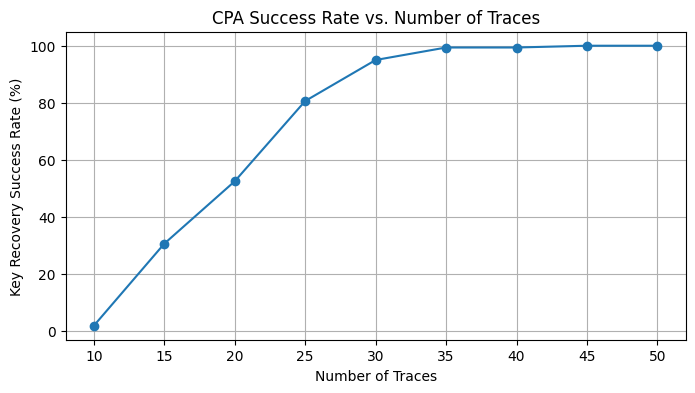

# AES-CPA-Attack

Reading an AES-128 key off a chip's power line. No access to the key, no access to the
implementation, just 50 recorded encryptions and the current the device drew while it ran.
All 16 key bytes come back in 8.6 seconds: `2b7e151628aed2a6abf7158809cf4f3c`.



Ten traces gets you almost nothing. Thirty gets you 95% of the key. By 35 the attack is
effectively deterministic, which is the real point: the secret is not protected by how hard
AES is to break, it is protected by how few measurements someone can take.

## How it works

AES starts by XORing each plaintext byte with a key byte and pushing the result through the
S-box. A CMOS device draws marginally more current when more bits are set, so the Hamming
weight of that S-box output bleeds into the power line. For each of the 16 key bytes, the
notebook guesses all 256 candidates, predicts the Hamming weight each guess implies for
every trace, and takes the Pearson correlation against the measured power at each of the
5,000 time samples. The correct guess correlates. The other 255 do not.

The target is the TinyAES-128 software implementation.

## Run it

```bash
git clone https://github.com/rayedkhan/AES-CPA-Attack.git
cd AES-CPA-Attack
pip install numpy pandas matplotlib jupyter
jupyter notebook aesCpaAttack.ipynb
```

Run the cells in order. `traces.csv` is in the repo: 50 rows, the first column a plaintext
as 32 hex characters and the remaining 5,000 the power samples recorded while that plaintext
was encrypted. The last cell re-runs the attack 90 times to build the curve above, so give it
a few minutes.

## License

MIT
